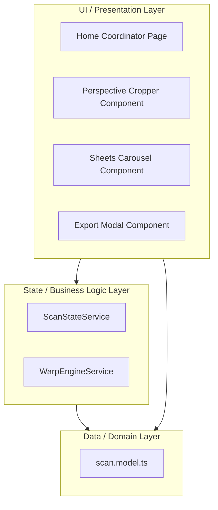

# DocScan

DocScan is a modern, high-performance, and visually stunning mobile-first document scanner and PDF compiler. Built with **Ionic 8** and **Angular 20**, it features an advanced decoupled standalone architecture, real-time coordinate math solvers, multi-threaded image processing filters, and automatic offline state recovery.

---

## Key Features

*   📷 **Flexible Inputs**: Capture documents directly via device camera, import from the photo gallery, or use local image file fallbacks.
*   📐 **Perspective Cropping**: Interactive bounding boxes with responsive drag touchpoints, an SVG dim overlay, and a canvas-rendered magnifying glass magnifier for high precision.
*   ⚡ **Web Worker Processing**: Intensive computational filters run in background thread pools (Web Workers) to keep the UI running at 60fps.
*   🎨 **Enhancement Presets**:
    *   *Original*: High-resolution raw input.
    *   *Magic Color*: Color balancing, noise reduction, and contrast enhancement.
    *   *Photocopy*: Clean, high-contrast monochrome grayscale.
*   🔄 **Batch Reordering**: Drag, delete, or rearrange sheets on the fly in the thumbnail carousel manager.
*   📄 **Premium PDF/PNG Export**: Compile documents in borderless, A4, or US Letter layout modes. Supports popup-blocker-safe downloads.
*   💾 **Auto-Save Session Recovery**: Offline storage syncing keeps your current active batch safe from reload resets.

---

## Architectural Layers

The application is structured into **three decoupled layers** to ensure maximum maintainability and fast compile times:



1.  **UI/Presentation Layer**: Composed of pure, standalone components (`perspective-cropper`, `sheets-carousel`, and `export-modal`). They receive data via Signal inputs and emit events via standard Angular Outputs.
2.  **State/Business Logic Layer**: Injects singleton services. `ScanStateService` is the single source of truth for the document batch signals and coordinates browser cache syncs. `WarpEngineService` manages math logic, filter transformations, and Web Worker thread pools.
3.  **Data/Domain Layer**: Houses strict type boundaries and interfaces (`Point`, `ScanPage`) guaranteeing strict typing across all features.

---

## Getting Started

### Prerequisites
Make sure you have Node.js and npm installed:
*   [Node.js](https://nodejs.org/) (v18+ recommended)
*   [Ionic CLI](https://ionicframework.com/docs/intro/cli) (optional, `npx` is supported)

### Installation
1. Clone the repository:
   ```bash
   git clone git@github.com:ugurgul9/image-to-pdf.git
   cd image-to-pdf
   ```
2. Install npm dependencies:
   ```bash
   npm install
   ```

### Development Scripts
*   **Run Development Server**: Runs the app locally at `http://localhost:8100`:
    ```bash
    npm run start
    ```
*   **Production Build**: Compiles optimized production bundle output into `www/`:
    ```bash
    npm run build
    ```
*   **Linting**: Runs TypeScript and template checks:
    ```bash
    npm run lint
    ```
