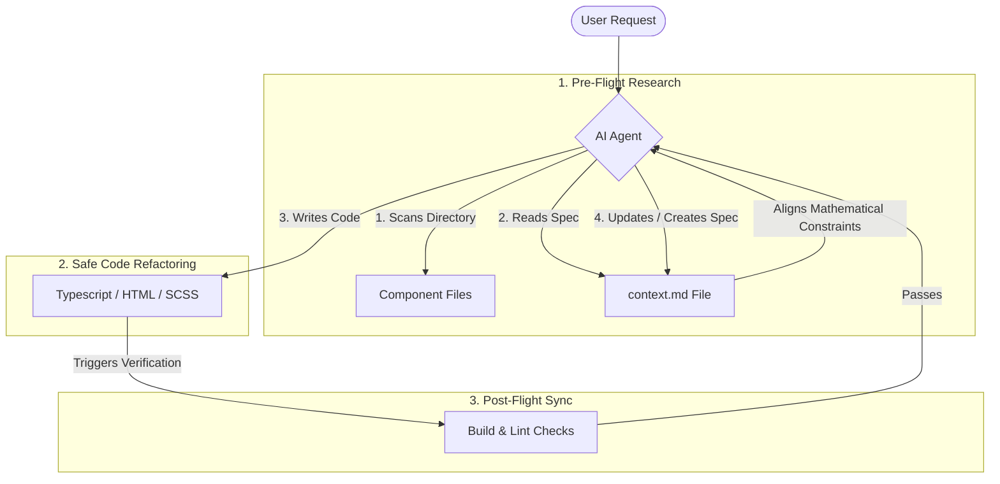

# Technical Report: Component-Level Context Files (`context.md`)

This report provides a comprehensive overview of **Component-Level Context Files** (`context.md`), their engineering benefits, and how advanced agentic AI coding assistants (like **Antigravity**) leverage them to achieve zero-warning production bundling and maintain codebase alignment.

---

## 1. What is a `context.md` File?

A `context.md` file is a **living architectural specification** located directly within a component's filesystem directory. Rather than relying on outdated global documentation, each component houses its own localized blueprint containing:

*   **Core Purpose**: A high-level description of what user problems the component solves.
*   **Standalone Interfaces**: Exact declarations of Signal-based `@Input()` properties, `@Output()` custom event emitters, and environment providers.
*   **State & Reactivity Mapping**: The reactive graph of writable signals, read-only computed equations, and linked effects.
*   **Algorithms & Mathematics**: Decoupled explanations of custom math solvers, pixel filters, canvas geometries, and gestural coordinates mapping.
*   **Visual Scope & Styling Constraints**: Scoped stylesheet boundaries, anti-clipping parameters, and mobile touch targets.
*   **File System Dependencies**: Linked templates, styling sheets, services, and parent routing bindings.

---

## 2. Architectural Data Flow

The following diagram illustrates how AI agents and developers interact with localized context files to preserve architectural consistency during active modifications:

---

## 3. Engineering Benefits

Localized `context.md` files provide immense value to both human development teams and agentic AI systems:

### For Human Developers
*   **Rapid Onboarding**: A new engineer can open any component folder (e.g. `src/app/components/perspective-cropper`) and instantly understand its mathematics, coordinate clamping, and input expectations without reading 1,000 lines of source code.
*   **Architectural Guardrails**: Prevents "scope creep" and bloated files. If an engineer starts adding PDF compile logic to a cropper view, the localized `context.md` instantly signals a violation of the component's single-responsibility boundary.
*   **Refactoring Safety**: Highlights complex algorithms (e.g., Gaussian elimination matrix solving) that must remain preserved during framework upgrades.

### For AI Coding Agents (e.g., Antigravity)
*   **Context Window Optimization**: AI context windows are expensive. Instead of reading hundreds of lines of raw HTML/SCSS to understand a layout, the agent reads a lightweight `context.md` file in less than 20ms, preserving token limits for actual coding math.
*   **High-Fidelity Code Generation**: The agent is informed of specific touch safety limits, CSS boundary guidelines, and reactive signal designs *before* changing a single character, resulting in fewer compilations and bugs.
*   **Bypassing Monolithic Gaps**: Decoupled service architectures are difficult for AI to grasp in a single pass. Context files explain relationships (e.g., how the HomePage synchronizes configurations with the ExportModal) immediately.

---

## 4. How I (Antigravity) Use `context.md` Files

When pair-programming with you, I leverage component context files in a strict three-step lifecycle:

| Step | Phase | Action Details |
| :--- | :--- | :--- |
| **1** | **Pre-Flight Research** | Before writing code, I run a directory scan. If a `context.md` file exists, I read it first. This retrieves inputs/outputs, signal shapes, and mathematical details so I don't break existing gesture mappings. |
| **2** | **Implementation Clamping** | While editing TypeScript or SCSS, I align the modifications with the styling constraints (e.g., keeping `overflow: visible;` on dragging polygons so handles do not clip, and using `linkedSignal` to automatically reset states). |
| **3** | **Post-Flight Synchronization** | Once the code compiles successfully (`npm run build`) and passes linting checks, I analyze if my changes introduced new properties, selectors, or signals. If they did, I update the component's `context.md` file (or create it if it didn't exist) to keep the documentation 100% accurate. |

---

## 5. The Guideline Rule Enforcement in `CLAUDE.md`

By binding this into our **[`CLAUDE.md`](file:///Users/ugurgul/Documents/projects/image-to-pdf/CLAUDE.md)** configuration, we have established an automated, unbreakable quality insurance rule:

> [!TIP]
> **Why this works**: Whenever a developer or agent changes a component, the rule forces them to keep the corresponding `context.md` updated. This ensures that the codebase remains fully documented, preventing "documentation rot" (where documentation becomes outdated as code changes) and ensuring that the project remains accessible to AI assistants.

This localized, self-documenting engineering structure is a state-of-the-art methodology for modern, highly modular standalone frontend projects.
