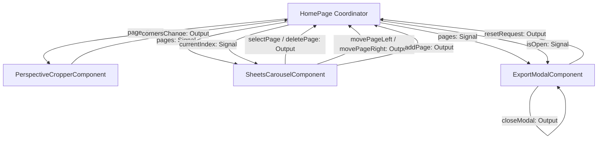

# Component Layer Context: Standalone UI Widgets

## Purpose
The `src/app/components` folder houses the reusable, standalone presentation components of DocScan. Following modern Angular standalone architecture guidelines, these widgets are completely decoupled from each other and do not store or mutate core application state. They receive all inputs via reactive Signal inputs and notify parent components of actions using event emitters (Outputs).

---

## Standalone Component Communication Flow

Children UI components speak only to their parent context (`HomePage` orchestrator) which binds them to the underlying reactive data signals:

---

## Technical Specifications Index

| Component / Subdirectory | Selector | Inputs | Outputs | Core Responsibility & UI Details |
| :--- | :--- | :--- | :--- | :--- |
| [`perspective-cropper/`](./perspective-cropper) | `app-perspective-cropper` | <ul><li>`page`: `input.required<ScanPage>()`</li></ul> | <ul><li>`cornersChange`: `output<Point[]>()`</li></ul> | Renders the primary cropping workspace. Tracks gesture drags on absolute points, displays a magnifier zoom canvas for fine precision adjusting, draws overlay polygons, and triggers auto-snap contour calculations. |
| [`sheets-carousel/`](./sheets-carousel) | `app-sheets-carousel` | <ul><li>`pages`: `input.required<ScanPage[]>()`</li><li>`currentIndex`: `input.required<number>()`</li></ul> | <ul><li>`selectPage`: `output<number>()`</li><li>`deletePage`: `output<number>()`</li><li>`movePageLeft`: `output<number>()`</li><li>`movePageRight`: `output<number>()`</li><li>`addPage`: `output<void>()`</li></ul> | Displays a horizontal thumbnail scroller showing all scanned sheets. Manages card selection outlines, sorting buttons (swapping page indexes), delete items, and addition prompts. |
| [`export-modal/`](./export-modal) | `app-export-modal` | <ul><li>`pages`: `input.required<ScanPage[]>()`</li><li>`isOpen`: `input.required<boolean>()`</li></ul> | <ul><li>`closeModal`: `output<void>()`</li><li>`resetRequest`: `output<void>()`</li></ul> | Manages the PDF/PNG rendering and compilation screens. Contains settings for layout, displays conversion progress loading indicators, success checks, and executes popup-blocker-safe browser downloads. |

---

## Development Guidelines for Reusable UI Component Layer
1.  **Strict State Isolation**: Never inject state management services (`ScanStateService`) directly into these component files. Components must remain pure display widgets that emit events to their parent.
2.  **No Inter-component Imports**: Standalone components must never import or consume other custom standalone sibling widgets directly. All communication must run upwards through parent parameters.
3.  **View Encapsulation Scoping**: Styling rules must be scoped internally inside the component SCSS sheets to prevent styles from bleeding out into other views.
