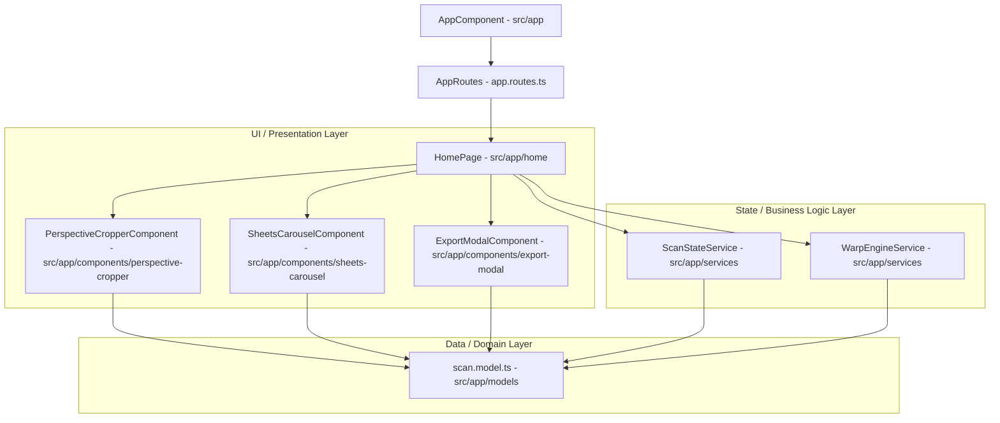

# App Root Context: Coordinator and Shell Layer

## Purpose
The `src/app` directory serves as the orchestration root of the DocScan Angular application. It is responsible for bootstrapping the main application shell (`AppComponent`), setting up application-wide routing (`app.routes.ts`), and housing the core logic layers (Data Models, Services, UI Components, and the Coordinator Page).

---

## Architectural Layers & Dependency Flow

DocScan is structured as a three-tier decoupled architecture:

### Layer Responsibilities
1.  **UI / Presentation Layer (`src/app/components` & `src/app/home`)**: Standalone, reusable UI widgets and pages. These are presentation-heavy, capturing user gestures, styling interfaces, and rendering frames. They do not store persistent state directly; they bind to the State Layer.
2.  **State / Business Logic Layer (`src/app/services`)**: Singleton services containing reactive state signals, local browser storage syncing (IndexedDB/localStorage), background processing thread pools (Web Workers), and image homography solvers.
3.  **Data / Domain Layer (`src/app/models`)**: Immutable typing declarations and models defining the data structures used by all layers.

---

## Directory Contents

| Path/File | Type | Scope & Responsibility |
| :--- | :--- | :--- |
| [`components/`](./components) | Directory | Collection of standalone, reusable UI widget folders. |
| [`home/`](./home) | Directory | The primary page component which coordinates app state changes and hosts the three scanner states (Welcome, Cropping, Preview). |
| [`models/`](./models) | Directory | House of TypeScript interfaces and typing systems. |
| [`services/`](./services) | Directory | Singleton business services executing state state machines and calculations. |
| [`app.component.ts`](./app.component.ts) | File | The root application shell component that bootstraps the main Ionic navigation stack (`<ion-app>`). |
| [`app.component.html`](./app.component.html) | File | Root template containing the router outlet shell (`<ion-router-outlet>`). |
| [`app.component.scss`](./app.component.scss) | File | Root component-scoped stylesheet for shell-specific element spacing. |
| [`app.component.spec.ts`](./app.component.spec.ts) | File | Unit testing configuration validating root app load. |
| [`app.routes.ts`](./app.routes.ts) | File | Central routing registry mapping default redirects and lazy-loading `/home`. |
