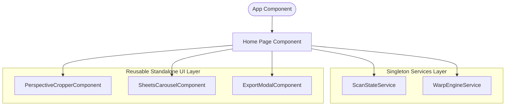

# Scoped Context: Home Component & Standalone Architecture

## Purpose
The `Home` component has been refactored from a monolithic "God Component" into a modern, decoupled standalone architecture. It serves as a lightweight coordinator shell injecting dedicated services and assembling reusable component directives. It maintains a zero-scroll, immersive viewport layout optimized for mobile touch safety.

---

## Technical Architecture & Decoupling

The business logic and UI grids are partitioned into dedicated layers:

### 1. Singleton Services Layer
*   **`ScanStateService`** (`src/app/services/scan-state.service.ts`):
    - Manages the primary document batch state: `pages` (`signal<ScanPage[]>`) and `currentPageIndex` (`signal<number>`).
    - Handles automated draft session serialization and IndexedDB recovery.
    - Exposes CRUD actions for batch editing: `addNewScanPage()`, `deletePage()`, `movePageLeft()`, `movePageRight()`.
    - Automatically coordinates silent, background perspective auto-warps (`cropPageInBackground()`) when users navigate or add pages.
*   **`WarpEngineService`** (`src/app/services/warp-engine.service.ts`):
    - Encapsulates low-level canvas computations, homography solvers, and Web Worker thread pools.
    - Solves an 8x8 projective homography linear system using **Gaussian Elimination** mapping source coordinates to destination coordinates.
    - Runs asynchronous pixel operations in a Web Worker, falling back to a synchronous main-thread task deferral (`runWarpSync()`) if workers fail.
    - Applies premium contrast algorithms: **Magic Color** (bleaches background shadows to white) and **Photocopy Grayscale** (luminance mapping).

### 2. Standalone UI Component Layer
*   **`PerspectiveCropperComponent`** (`src/app/components/perspective-cropper/perspective-cropper.component.ts`):
    - Renders the image workspace, handles gesture-based absolute handle dragging, and draws the magnifier canvas.
    - Utilizes a `linkedSignal` bound to the input `page` to automatically reset handles and viewport states when sheets change.
    - Performs smart **Auto-Crop Edge Contour Snapping** using global average luminance thresholding in under 15ms.
*   **`SheetsCarouselComponent`** (`src/app/components/sheets-carousel/sheets-carousel.component.ts`):
    - Renders the horizontal sliding preview sheets, active-highlight cards, sort reordering arrows (`←` / `→`), and deletion triggers.
*   **`ExportModalComponent`** (`src/app/components/export-modal/export-modal.component.ts`):
    - Completely encapsulates the document compilation engine (`jsPDF`), sequential high-res image exports, and interactive modal dialog screens.
    - Operates a synchronous, popup-blocker-safe new tab trigger (`window.open`).

---

## File System Dependencies
- `src/app/home/home.page.html` (Immersive coordinator view using modern `@if` syntax)
- `src/app/home/home.page.scss` (Main layout shell and welcome grid styles)
- `src/app/home/home.page.ts` (Thin coordinator component controller)
- `src/app/services/scan-state.service.ts` (Batch list state singleton service)
- `src/app/services/warp-engine.service.ts` (Linear algebra matrix solver and Web Worker thread pool)
- `src/app/components/perspective-cropper/` (Draggable handles, magnifier canvas, and auto-snap solvers)
- `src/app/components/sheets-carousel/` (Sliding card previews and shifting sorting controllers)
- `src/app/components/export-modal/` (Compilation settings, jsPDF file creation, and success card dialogs)
